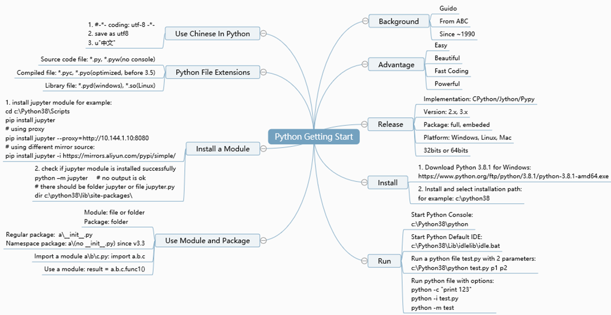

# Part 1 Getting Start

## 1.1 Execution Options and Argv

```commandline
>>> import sys
>>> print(sys.argv)
['']
```
```commandline
$ cat test.py
import sys
print("sys.argv:", sys.argv, "__name__:", __name__)

$ python test.py p1 p2
sys.argv: ['test.py', 'p1', 'p2'] __name__: __main__

$ python -c "import test" p1 p2
sys.argv: ['-c', 'p1', 'p2'] __name__: test
# python -c command line #

$ python -m test p1 p2
sys.argv: ['C:\\Code\\python-demo\\understanding_python\\test.py', 'p1', 'p2'] __name__: __main__

$ python -i test.py p1 p2
sys.argv: ['test.py', 'p1', 'p2'] __name__: __main__

```

* python –c  # cmd line
* python –m # module
* python –i   # interact
* sys.argv[0]: script name
* sys.argv[1:]: param list

#### Encoding type

```python
# -*- coding: utf-8 -*-
```
or
```python
#! /usr/local/bin/python
# -*- coding: utf-8 -*-
```

## 1.2 Use Module and Package

### Import a Module

* Typically, a module can be a python file or folder
    * if there is a\b\c.python in current folder
    * import a.b.c # a, a.b, a.b.c are all modules
    
* If a module is a folder, we also call it a 'package'
    * for example: a, a.b are packages, but a.b.c is not
    
### Use a module

* After import, we can use function/variables inside this module
    * result = a.b.c.func1()
    * print(a.b.c.var1)
    
### Run sequence of import

* Assume there are following files in current folder:
    * a\\__init\__.py
    * a\b\\__init\__.py
    * a\b\c.py
    
* What happens after "import a.b.c"
    * run a\\__init\__.py
    * run a\b\\__init\__.py
    * run a\b\c.py # if there is a\b\c\\__init\__.py, which has high priority to run
    
### Regular Package and Namespace Package

* Assume there are following files in current folder
    * a\ (no have \__init\__.py file)
    * a\b\\__init\__.py
    * a\b\c.py
    
* What happens after "import a.b.c"?
    * python2: ImportError: No module named a.b.c
    * python3: 
        * run a\b\\__init\__.py
        * run a\b\c.py
        * Following modules will be available: a, a.b, a.b.c
    
* a is a namespace package(because no \__init\__.py)
* a.b is regular package(because there has \__init\__.py)

## 1.3 Python Files and Compiling

#### Python File Extensions
* py: python source file
* pyw: same as .py except that when run whit python in windows, 
  the console windows that normally appears is suppressed
* pyc: python complied source code file
* pyd,so: python lib code, pyd for windows, so for linux
* pyo: python optimized code, support before version 3.5

## 1.4 Python file compiling

#### how to compile pyc file
```commandline
import foo
import py_compile

py_compile.compile("foo.py")
```
or
```commandline
python -m py_compile foo.py
python -m compileall . # compile all files in the folder
```

#### pyc files location

in the subfolder `__pycache__`

## 1.5 In Summary

